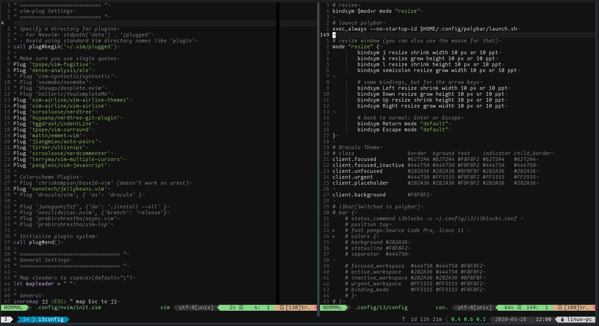
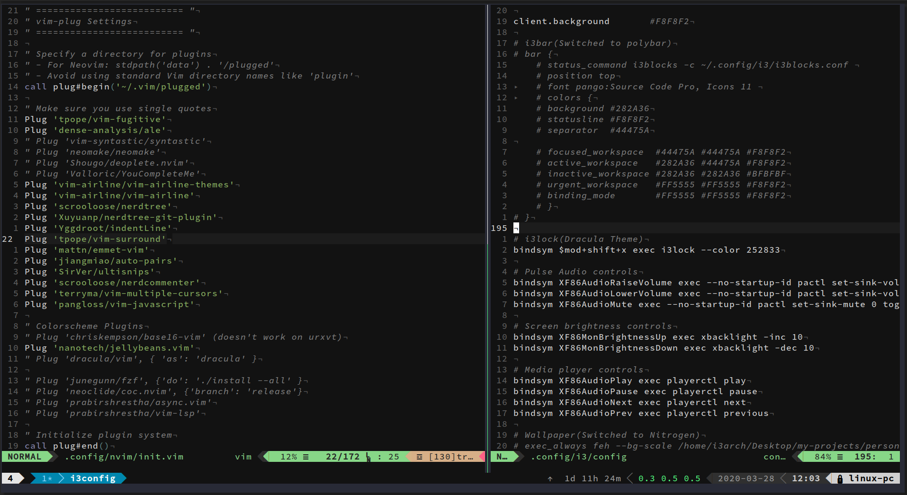

If you're like me, you fiddle around with your development setup and dotfiles frequently tweaking and breaking things and learning along the way.

I only recently found out that you could have comments on Vim appear in _italics_. All you need to do is add `highlight Comment cterm=italic` to your `.vimrc`. Except, it's usually not that straightforward! I spent 3.5 hours researching how to properly enable italics in Vim and then, in Vim inside [tmux](https://github.com/tmux/tmux) and found out some genuine and a few stupid reasons things might not work as expected on your system.

Here, I will provide you official instructions to solving this problem and things you should care about if they don't work.

## Italics in Vim

Before jumping right in, I think it's a good idea to learn some basics of what is actually needed to render italics in your terminal.

- ### Environment variables

  An environment variable is a named object that contains data used by one or more applications. In simple terms, it is a variable with a name and a value. The value of an environmental variable can for example be the location of all executable files in the file system, the default editor that should be used, or the system locale settings. [_ArchWiki_](https://wiki.archlinux.org/index.php/Environment_variables)

- ### TERM

  TERM is a common environment variable used by a Linux system that contains the type of the running terminal. It is used by programs running in the terminal that wish to use terminal-specific capabilities. To see the value of TERM environment variable in your system, run `echo $TERM`. In most cases, it will be something like `xterm-256color` if you're using a 256 color terminal.

- ### Terminfo

  Terminfo is a data base describing terminals, used by screen-oriented programs such as vi, and libraries such as curses. Terminfo describes terminals by giving a set of capabilities which they have, by specifying how to perform screen operations, and by specifying padding requirements and initialization sequences. [_linux.die.net_](https://linux.die.net/man/5/terminfo)

- ### `infocmp`

  `infocmp` can be used to compare or print terminfo descriptions.

- ### `tic`/`toe`

  `tic` is the terminfo entry-description compiler. This command translates the terminfo files from source format into compiled format. To view all terminfo entries on your system, type `toe`.

And now we can begin. To have italics enabled in terminal Vim/Neovim, you need to have a terminal emulator that supports italics. To check this for your terminal, type the following:

```shell
$ echo -e "\e[3m foo \e[23m"
```

If you see the output _`foo`_ (in italics), then congratulations! Your terminal can support italics. If you don't, I recommend you switch to a more [modern](https://github.com/jwilm/alacritty) [terminal](http://software.schmorp.de/pkg/rxvt-unicode.html) [emulator](https://st.suckless.org/).

If you don't see italicised _`foo`_ above, then you need to add a custom terminfo. Fortunately, there is [one](https://gist.github.com/sos4nt/3187620) that we can use. To download it:

```shell
$ curl -L https://gist.githubusercontent.com/sos4nt/3187620/raw/bca247b4f86da6be4f60a69b9b380a11de804d1e/xterm-256color-italic.terminfo -o xterm-256color-italic.terminfo
```

Alternatively, you can create a file named `xterm-256color-italics.terminfo` and put these lines in it:

```
xterm-256color-italic|xterm with 256 colors and italic,
  sitm=\E[3m, ritm=\E[23m,
  use=xterm-256color,<Paste>
```

Now, compile the `xterm-256color-italic.terminfo` file with `tic`:

```shell
$ tic xterm-256color-italic.terminfo
```

Lastly, load it in your `~/.bashrc` or `~/.zshrc`:

```shell
$ echo "export TERM=xterm-256color-italic" >> ~/.bashrc
# or
$ echo "export TERM=xterm-256color-italic" >> ~/.zshrc
```

Source your `.bashrc` (`source ~/.bashrc`), restart the terminal and try the test above to make sure your terminal now outputs the italicised _`foo`_.

Now, to have italicized comments in Vim, add this line to your `.vimrc` / `init.vim` **after you declare your colorscheme**:

```vim
highlight Comment cterm=italic
```

Save and open the file again. Did it work? Yes? Great. But if it didn't, restart your terminal and open the file again. This should work now.

If you still don't see italics, add these lines to your `.vimrc`:

```vim
set t_ZH=^[[3m
set t_ZR=^[[23m
```

These are special terminal options that enable italics mode and italics end respectively using proper escape sequences used by Vim to get information about the running terminal.

**Note**: The characters `^[` must be entered with `<Ctrl-v><Esc>`.

**Sidenote**: If you're using [jellybeans.vim](https://github.com/nanotech/jellybeans.vim#italics) colorscheme for Vim, put this line after `colorscheme jellybeans`:

```vim
let g:jellybeans_use_term_italics = 1

" For onedark.vim - https://github.com/joshdick/onedark.vim#options
let g:onedark_terminal_italics = 1
```

## Italics in Vim inside tmux

If you made it this far, chances are you are using a terminal multiplexer like tmux for managing multiple sessions in the terminal. But if you try the test above inside tmux, you'll notice italics don't work anymore. This is because tmux sets the environment variable `TERM` to `screen-256color` instead of `xterm-256color` and hence uses the italics escape sequence incorrectly. For tmux 2.1 and above, you'd have had to create a new terminfo entry:

```shell
$ cat <<EOF|tic -x -
tmux|tmux terminal multiplexer,
    ritm=\E[23m, rmso=\E[27m, sitm=\E[3m, smso=\E[7m, Ms@,
    use=xterm+tmux, use=screen,

tmux-256color|tmux with 256 colors,
    use=xterm+256setaf, use=tmux,
EOF
```

And then tell tmux to use it in `~/.tmux.conf`:

```shell
set -g default-terminal "tmux"
# or
set -g default-terminal "tmux-256color"
```

For more recent tmux versions, just adding the above line to `~/.tmux.conf` suffices. A new terminfo entry may not be required.

See [tmux FAQs](https://github.com/tmux/tmux/wiki/FAQ#i-dont-see-italics-or-italics-and-reverse-are-the-wrong-way-round) and [tmux 2.1 FAQs](https://github.com/tmux/tmux/blob/2.1/FAQ#L355-L383).

If you still don't see italics in tmux, **make sure** that you don't have any tmux sessions running on your system (`tmux kill-server`), then try again.

Also, make sure you have an italics capable font enabled. I have tested this on rxvt-unicode with [Source Code Pro](https://github.com/adobe-fonts/source-code-pro) and on Alacritty with [Mononoki Nerd Font](https://github.com/ryanoasis/nerd-fonts).

_<small>Italics in Vim + tmux + Alacritty + Mononoki Nerd Font</small>_ :

_<small>Italics in Vim + tmux + urxvt + Source Code Pro Font</small>_ :


## Further reading

- [tmux FAQs](https://github.com/tmux/tmux/wiki/FAQ)
