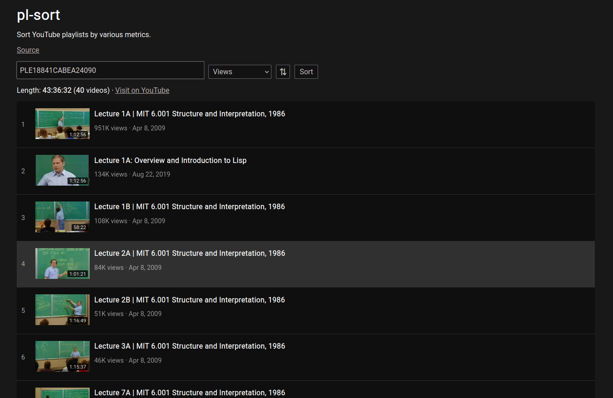

For some reason, YouTube doesn't let you sort playlists by criteria like views and lengths of videos.

So, I made [pl-sort](https://pl-sort.netlify.app). It allows you to enter a playlist link or id and sort it by views, duration of videos, like/dislike counts, title (alphabetically), date of publication, and of course, the default order.

It also shows you the total duration of the playlist.

For fun, I tried to make the interface as close to YouTube's official design.

If you need this frequently, you can install the [extension](https://addons.mozilla.org/en-US/firefox/addon/pl-sort) for your browser. This adds an option to open a playlist directly in pl-sort by adding a "**Open in pl-sort**" option to context menu when YouTube playlist links are right-clicked.

To contribute, submit your issues and feedback on [GitHub](https://github.com/rsapkf/pl-sort).

