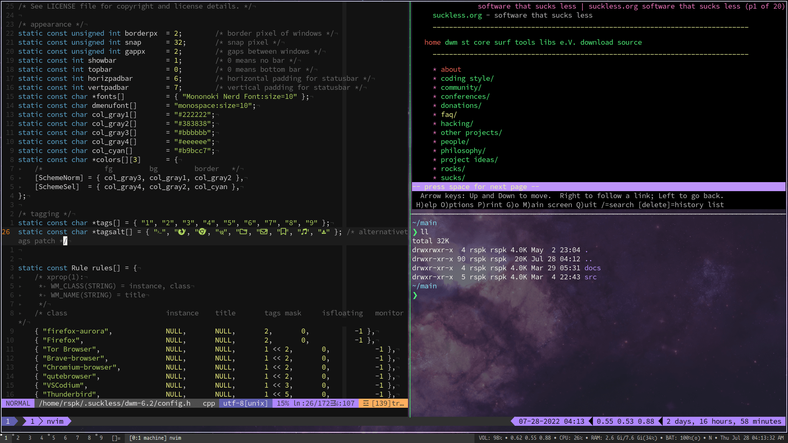

As someone deeply interested in programming, \*nix, open source and STEM in general, during my learning process, I have been into countless rabbitholes. Let me tell you about one.

After I switched entirely to Linux last year, I decided to learn C++ by following a Stroustrup's [book](https://www.stroustrup.com/programming.html) on C++. As a Sublime Text/Atom guy, I decided to do the exercises in Vim to brush up on my Vim skills.

I found myself constantly switching between Vim, terminal, e-book viewer and my browser windows in order to solve the problems. As an Ubuntu Gnome newbie, I was using the `Alt+Tab` key combination to do so. Eventually, I realized I could do the same thing using `Super+Tab` keys! It was surprising to me because I had always used the former solution since Windows. To see which was more common among other Linux users, I did a quick search on the web.

I found a Reddit thread where someone had asked the same question. The first comment on the thread said, "`Alt+Tab` because I didn't know `Super` could do that as well." Okay. But what was the beginning of the biggest distraction of my life, was the second comment with 7 upvotes. It said, "Neither, because I use i3wm. :)"

Now, as a voraciuosly curious person, I _had_ to do a quick search — I had never heard of i3wm before. As some of you might already know, it's a powerful and popular tiling window manager. One look into its documentation, I knew I always needed something like this in order to do things effectively.

I found that the default look that `i3` comes with isn't very attractive. Not just its look, but I had to do a number of additions and modifications to its config file to make things work properly.

For example, it isn't very straightforward to set a wallpaper. You have to install and configure a separate little program called [feh](https://wiki.archlinux.org/index.php/Feh) in order to do so (mind you, there are [alternatives](https://wiki.archlinux.org/index.php/Nitrogen)). It took me 3 weeks to make it usable for my needs (i3-gaps, i3blocks, touchpad configuration, audio controls, fonts, colors, keybindings, etc) and during that period, I came across the Arch Linux wiki, and that was it, I had discovered the holy grail of [unix configuration](https://www.reddit.com/r/unixporn/wiki/themeing/dictionary#wiki_rice).

It was only a matter of days that I came across [r/unixporn](https://reddit.com/r/unixporn), [Luke Smith](https://www.youtube.com/channel/UC2eYFnH61tmytImy1mTYvhA), [DistroTube](https://www.youtube.com/channel/UCVls1GmFKf6WlTraIb_IaJg), etc. Now my computer looks like [this](https://github.com/rsapkf/dotfiles) and I have an entire [repository](https://github.com/rsapkf/config) on Github to backup and store my dotfiles in case I want to change my distro. I became another 'btw, I use Arch' guy, I'm constantly configuring my system, and my bookmarks have begun to rise in number exponentially. I discover and use new tools and open source software programs all the time AND I haven't yet gone back to the C++ book. I think It'll be another month or so before I resume it but there is no denying that that stupid question has taught me so much.

If this sounds interesting to you, I recommend trying out a window manager first. Because of the excellent documentation that it has, my personal suggestion is to go for [i3](https://i3wm.org) first. If you like minimalism and don't mind having to patch your window manager everytime you want to extend it, go for [dwm](https://dwm.suckless.org). If you are a Haskell fan, try [xmonad](https://github.com/xmonad/xmonad). [There](https://github.com/Airblader/i3) [are](https://github.com/baskerville/bspwm) [several](http://www.qtile.org/) [options](https://awesomewm.org/) [to](http://www.herbstluftwm.org/) [choose](http://openbox.org/) [from](https://www.youtube.com/playlist?list=PL5--8gKSku17lbSBHPduj4qG97qxJe0UM). If you need a quick comparison between features of different WMs, check out [this](https://wiki.archlinux.org/index.php/Window_manager#List_of_window_managers) ArchWiki page or [this video](https://www.youtube.com/watch?v=Obzf9ppODJU) from DistroTube. Once you get the hang of how dotfiles work, check out the [unofficial guide to doing dotfiles](https://dotfiles.github.io/). Also, just bookmark [ArchWiki](https://wiki.archlinux.org) and [GentooWiki](https://wiki.gentoo.org/wiki/Main_Page), no matter which distro you are using.

_Updates: I have moved to `dwm` since December 2019._
